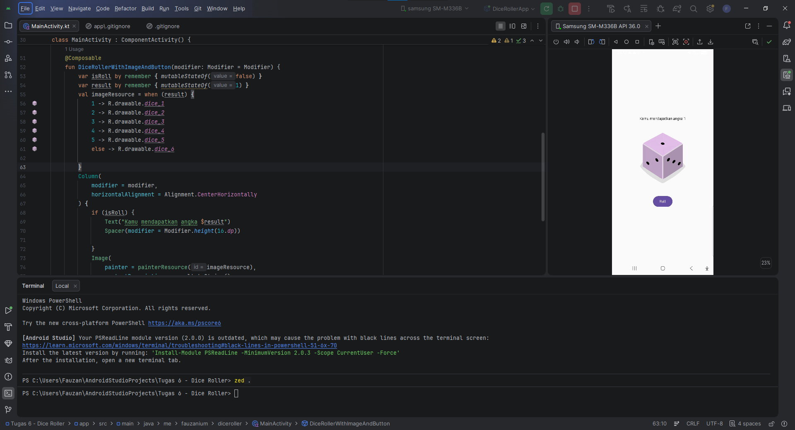

# Dice Roller App

Dice Roller App adalah aplikasi Android interaktif sederhana yang dibuat menggunakan Jetpack Compose dan Kotlin. Aplikasi ini memungkinkan pengguna untuk melempar dadu secara acak dengan menekan sebuah tombol, menampilkan gambar dadu yang sesuai, serta memperlihatkan teks hasil angka yang didapatkan.

## Fitur Utama

* Lempar Dadu Acak: Mengacak angka 1 hingga 6 secara otomatis ketika tombol ditekan.
* Tampilan Visual Dadu: Gambar dadu menyesuaikan secara real-time berdasarkan angka hasil acakan.
* Pesan Hasil: Menampilkan teks informasi angka yang didapatkan setelah tombol pertama kali ditekan.

## Teknologi yang Digunakan

* Language: Kotlin

* Jetpack Compose

## Struktur Kode

Seluruh logika dan antarmuka aplikasi ini terdapat dalam satu file utama (`MainActivity.kt`):

1. MainActivity & DiceRollerApp
   Merupakan titik masuk utama aplikasi yang mengatur tema (`DiceRollerTheme`) dan tata letak layar penuh.

2. DiceRollerWithImageAndButton
   Fungsi Composable utama yang mengelola:
   - State `isRoll`: Menandai apakah pengguna sudah menekan tombol setidaknya satu kali.
   - State `result`: Menyimpan angka acak dadu (1 sampai 6).
   - Logika `when`: Menentukan gambar dadu (`dice_1` hingga `dice_6`) berdasarkan nilai `result`.
   - Layout `Column`: Menyusun teks hasil, gambar dadu, dan tombol "Roll" secara vertikal di tengah layar.
