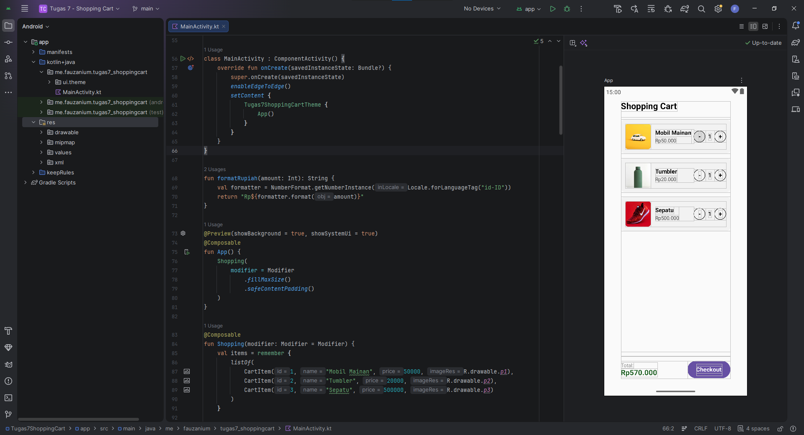

# Shopping Cart App

Aplikasi Shopping Cart adalah aplikasi Android sederhana yang dibangun menggunakan Jetpack Compose. Aplikasi ini mensimulasikan fitur keranjang belanja, mulai dari menampilkan daftar produk, merubah jumlah barang, hingga mengkalkulasi total harga secara otomatis.

## Fitur Utama

- Daftar Produk: Menampilkan gambar, nama, dan harga produk.
- Pengaturan Kuantitas: Menambah atau mengurangi jumlah barang secara fleksibel.
- Perhitungan Otomatis: Total harga diperbarui secara terhitung dari kuantitas dan harga masing-masing produk.
- Format Mata Uang: Menampilkan format harga dalam Rupiah (IDR).
- Checkout: Menampilkan pesan konfirmasi setelah pengguna menekan tombol checkout.

## Teknologi yang Digunakan

- Language: Kotlin
- Jetpack Compose

## Struktur Kode

Aplikasi ini berada dalam satu file utama (`MainActivity.kt`) yang terdiri dari beberapa komponen:

1. CartItem
Data class yang menyimpan informasi produk seperti ID, nama, harga, dan ID resource gambar.

2. MainActivity & App
Entry point aplikasi yang mengatur tema dan padding layar (edge-to-edge).

3. Shopping
Composable utama yang mengelola state daftar belanja, jumlah kuantitas (`mutableStateListOf`), status checkout, dan kalkulasi total harga.

4. ItemCard
Composable komponen UI untuk menampilkan setiap item dalam bentuk kartu terpisah, lengkap dengan tombol penambah dan pengurang kuantitas.

5. formatRupiah
Fungsi bantuan untuk mengubah nilai integer menjadi format mata uang Rupiah (`id-ID`).
